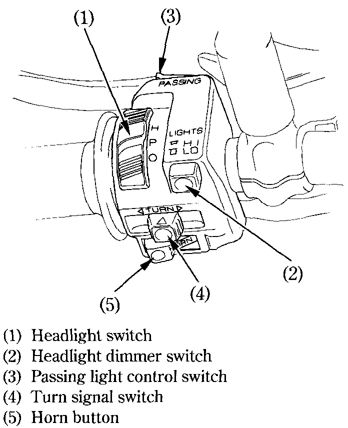

# Left Handlebar Control

### Headlight Switch \(1\)​

The headlight switch \(1\) has three positions: H, P and OFF, marked by a white dot.​

* H: Headlight, taillight, potision light and meter lights on.​
* P: Position light, taillight and meter lights on.​
* OFF \(dot\): Headlight, taillight, potision light and meter lights off.​

### Headlight Dimmer Switch \(2\)​

Push the dimmer switch to "HI" to select high beam or to "LO" to select low beam.​

### Passing Light Control Switch \(3\)​

When this switch is pressed, the headlight flashes on to signal approaching cars or when passing.​

### Turn Signal Switch \(4\)​

Move to &lt; to signal a left turn, &gt; to signal a right turn. Press to turn signal off.​

### Horn Button \(5\)​

Press the button to sound the horn.​

