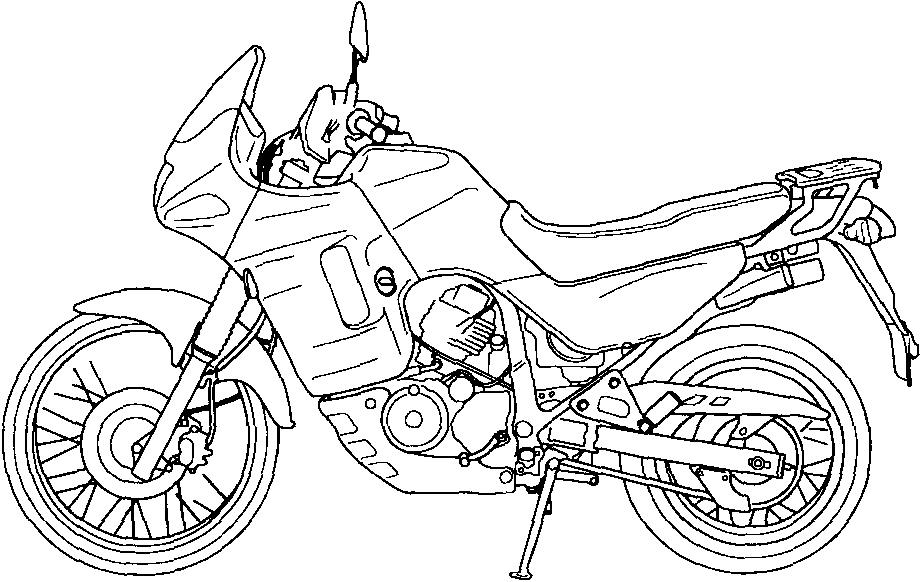

# Honda Transalp

## OWNER'S MANUAL

#### All information in this publication is based on the latest production information available at the time of approval for printing. HONDA MOTOR CO., LTD. reserves the right to make changes at any time without notice and without incurring any obligation.

#### No part of this publication may be reproduced without written permission.

### Important Notice

#### Operator and Passengers

This Motorcycle is designed to carry the operator and one passenger. Never exceed the maximum weight capacity as shown on the tyre information label.

#### On/Off-road Use

This motorcycle is designed for "dual purpose" use.

#### Read This Owner's Manual Carefully

Pay special attention to statements preceded by the following words:


**Warning**  
Indicates a strong possibility of severe personal injury or death if insrtuctions are not followed.



**Caution**  
Indicates a possibility of personal injury or equipment damage if insrtuctions are not followed.



**Note**  
Gives helpful information.


