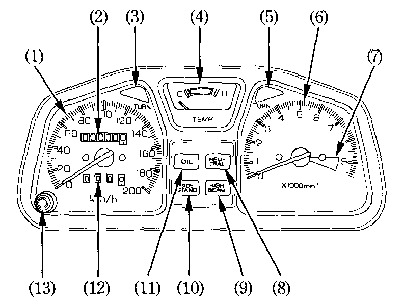
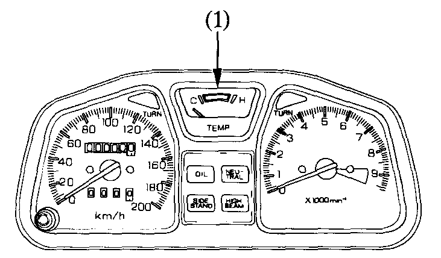

# Instruments and Indicators

The instruments are grouped together above the headlight case. Their functions are described in the table below.

1. Speedometer
2. Odometer
3. Left turn signal indicator
4. Coolant temperature gauge
5. Right turn signal indicator
6. Tachometer
7. Tachometer red zone
8. Neutral indicator
9. High beam indicator
10. Side stand indicator
11. Low oil pressure indicator
12. Tripmeter
13. Tripmeter reset knob

| \(Ref. No.\) | Description | Function |
| :---: | :--- | :--- |
| \(1\) | Speedometer | Shows riding speed. |
| \(2\) | Odometer | Shows accumulated mileage. |
| \(3\) | Left turn signal indicator \(amber\) | Flashes when the left turn signal operates. |
| \(4\) | Coolant temperature gauge | Shows coolant temperature [\[scroll\]](01.md#coolant-temperature-gauge). |
| \(5\) | Right turn signal indicator \(amber\) | Flashes when the right turn signal operates. |
| \(6\) | Tachometer | Shows engine rpm. |
| \(7\) | Tachometer red zone | Never allow the tachometer needle to enter the red zone, even after the engine has been run in. |
| \(8\) | Neutral indicator \(green\) | Lights when the transmission is in neutral. |
| \(9\) | High beam indicator \(blue\) | Lights when the headlight is on high beam. |
| \(10\) | Side stand indicator \(amber\) | Lights when the side stand is put down. Before parking, check that the side stand is fully down; the light only indicates the side stand ignition cut-off system [\[see page\]](https://xl400v.gitbook.io/honda-transalp/owners-manual/05/05) is activated. |
| \(11\) | Low oil pressure indicator \(red\) | Light when engine oil pressure is below normal operating range. Should light when ignition switch is ON and engine is not running. Should go out when engine starts, except for occasional flickering at or near idling speed when engine is warm. |
| \(12\) | Tripmeter | Shows mileage per trip. |
| \(13\) | Tripmeter reset knob | Resets tripmeter to zero \(0\) by pushing the knob. |


**Caution**  
• \(7\) Running the engine beyond recommended maximum engine speed \(tachometer red zone\) can damage the engine.  
• \(11\) Running the engine with insufficient oil pressure may cause serious engine damage.


## Coolant Temperature Gauge

When the needle begins to move above the C \(Cold\) mark, the engine is warm enough for the motorcycle to be ridden. The normal operating temperature range is within the section between the H and C marks. If the needle reaches the H \(Hot\) mark, stop the engine and check the reserve tank coolant level. Read [\[see page and scroll\]](https://github.com/xl400v/honda_transalp_manual/tree/bd2e6354e956a792611d16cc78b4fbe161d35b5d/owners-manual/03/03/README.md#inspection) and do not ride the motorcycle until the problem has been corrected.


**Caution**  
Exceeding maximum running temperature may cause serious engine damage.


1. Coolant Temperature Gauge

