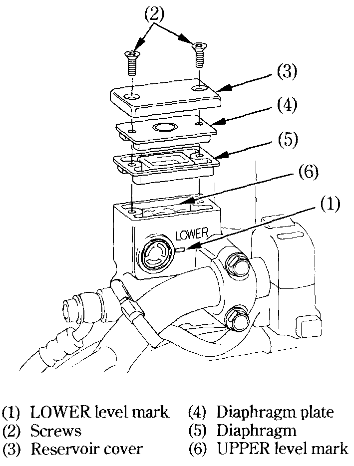
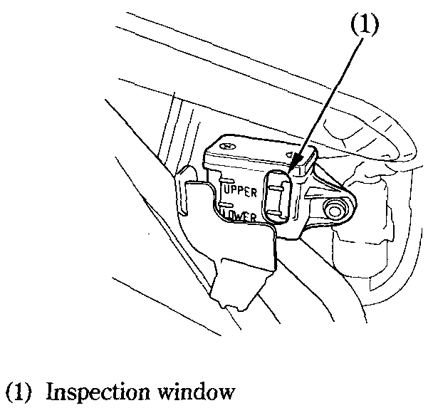
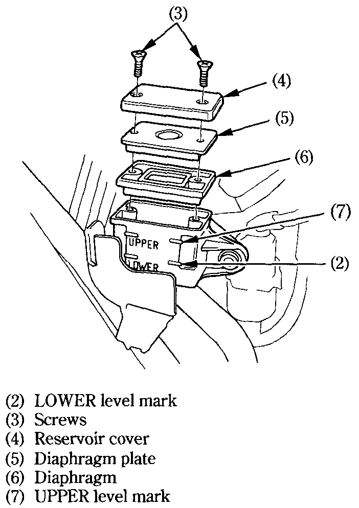

# Brakes

Both the front and rear brakes are the hydraulic disc types.

As the brake pads wear, the brake fluid level drops.

There are no adjustments to perform, but fluid level and pad wear must be inspected periodically. The system must be inspected frequently to ensure there are no fluid leaks. If the control lever or pedal free travel becomes excessive and the brake pads are not worn beyond the recommended limit [\[see page\]](https://xl400v.gitbook.io/honda-transalp/owners-manual/07/16), there is probably air in the brake system and it must be bled. See your authorized Honda dealer for this service.


**Warning**  
&bull;&nbsp;Brake fluid may cause irritation. Avoid contact with skin or eyes. In- case of contact, flush thoroughly with water and call a doctor if your eyes were exposed.  
&bull;&nbsp;KEEP OUT OF REACH OF CHILDREN.



**Caution**  
&bull;&nbsp;Handle brake fluid with care because it can damage plastic and painted surfaces.  
&bull;&nbsp;When adding brake fluid, be sure the reservoir is horizontal before the cap is removed or brake fluid may spill out.  
&bull;&nbsp;Use only DOT 4 brake fluid from a sealed container.  
&bull;&nbsp;Never allow contaminants such as dirt or water to enter the brake fluid reservoir.


### Front Brake Fluid Level

Check that the fluid level is above the LOWER level mark \(1\) with the motorcycle in an upright position.

Brake fluid must be added to the reservoir whenever the fluid level begins to reach the LOWER level mark \(1\). Remove the screws \(2\), reservoir cover \(3\), diaphragm plate \(4\), and diaphragm \(5\). Fill the reservoir with DOT 4 BRAKE FLUID from a sealed container up to the upper level mark \(6\). Reinstall the diaphragm, diaphragm plate, and cover. Tighten the screws securely.

### Rear Brake Fluid Level

Check the brake fluid level from the inspection window \(1\) of the right side cover with the motorcycle in an upright position.

Brake fluid must be added to the reservoir whenever the fluid level begins to reach the LOWER level mark \(2\). Remove the right side cover [\[see page\]](https://xl400v.gitbook.io/honda-transalp/owners-manual/05/03). Remove the screws \(3\), reservoir cover \(4\), diaphragm plate \(5\) and diaphragm \(6\). Fill the reservoir with DOT 4 BRAKE FLUID from a sealed container up to the UPPER level mark \(7\). Reinstall the diaphragm, diaphragm plate and cover. Tighten the screws securely.

### Other Checks

Make sure there are no fluid leaks. Check for deterioration or cracks in the hoses and fittings.

