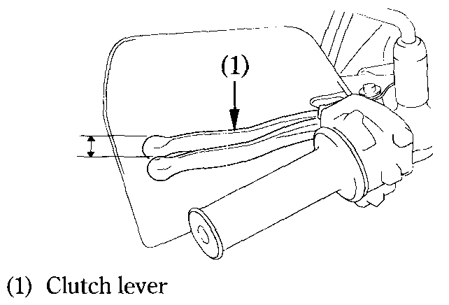
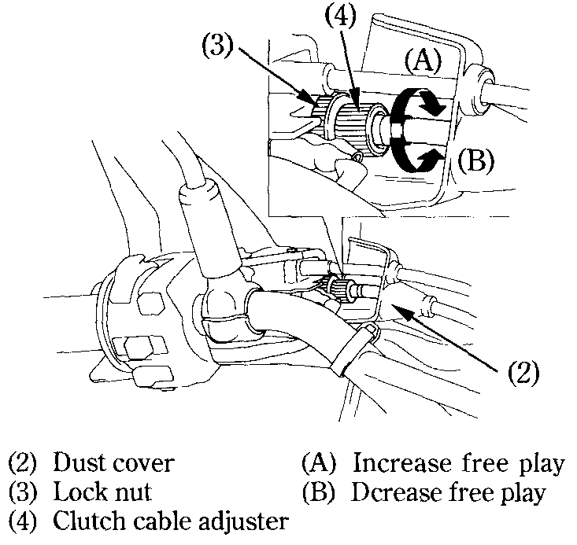
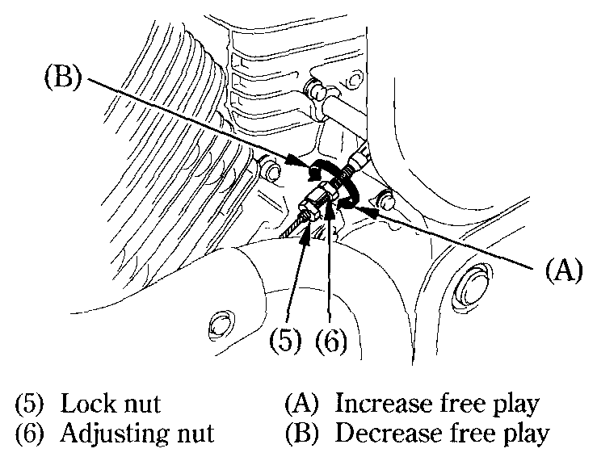

# Clutch

### Adjustment

Clutch adjustment may be required if the motorcycle stalls when shifting into gear or tends to creep; or if the clutch slips, causing acceleration to lag behind engine speed. Minor adjustments can be made with the clutch cable adjuster \(4\) at the lever \(1\). Normal clutch lever free play is:

* 10-20&nbsp;mm \(0.4-0.8&nbsp;in\)

1. Pull back the rubber dust cover \(2\). Loosen the lock nut \(3\) and turn the adjuster \(4\). Tighten the lock nut \(3\) and check the adjustment.

2. If the cable adjuster is threaded out near its limit or the correct free play cannot be obtained using the cable adjuster \(4\), a major adjustment must be made. Loosen the lock nut \(3\) and turn in the cable adjuster \(4\) completely. Tighten the lock nut \(3\) and install the rubber dust cover \(2\).

3. Loosen the lock nut \(5\) at the lower end of the cable. Turn the adjusting nut \(6\) to obtain the specified free play. Tighten the lock nut \(5\) and check the adjustment.

4. Start the engine, pull in the clutch lever and shift into gear. Make sure the engine does not stall and the motorcycle does not creep. Gradually release the clutch lever and open the throttle. The motorcycle should begin to move smoothly and accelerate gradually.


**Note**  
If proper adjustment cannot be obtained or the clutch does not work correctly, see your authorized Honda dealer.


### Other Checks

Check the clutch cable for kinks or signs of wear that could cause sticking or failure. Lubricate the clutch cable with a commercially available cable lubricant to prevent premature wear and corrosion.

