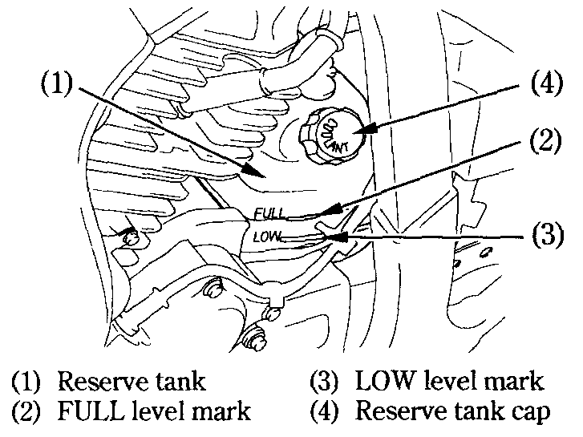

# Coolant

### Coolant Recommendation

The owner must properly maintain the coolant to prevent freezing, overheating, and corrosion. Use only high quality ethylene glycol antifreeze containing corrosion protection inhibitors specifically recommended for use in aluminum engines. \(SEE ANTIFREEZE CONTAINER LABEL\).​


**Caution**  
Use only low-mineral drinking water or distilled water as a part of the antifreeze solution. Water that is high in mineral content or salt may be harmful to the aluminum engine.


The factory provides a 50/50 solution of antifreeze and distilled water in this motorcycle. This coolant solution is recommended for most operating temperatures and provides good corrosion protection. A higher concentration of antifreeze decreases the cooling system performance and is recommended only when additional protection against freezing is needed. A concentration of less than 40/60 \(40% antifreeze\) will not provide proper corrosion protection. During freezing temperatures, check the cooling system frequently and add higher concentrations of antifreeze \(up to a maximum of 60% antifreeze​

### Inspection​

The reserve tank is in front of the air cleaner case.​

Check the coolant level in the reserve tank \(1\) while the engine is at the normal operating temperature with the motorcycle in an upright position. If the coolant level is below the LOW level mark \(3\), remove the reserve tank cap \(4\) and add coolant mixture until it reaches the FULL level mark \(2\). Do not remove the radiator cap.​


**Warning**  
Do not remove the radiator cap when the engine is hot. The coolant is under pressure and could scald you.  
Keep hands and clothing away from the cooling fan, as it starts automatically.


If the reserve tank is empty, or if coolant loss is excessive, check for leaks and see your authorized Honda dealer for repair.​

