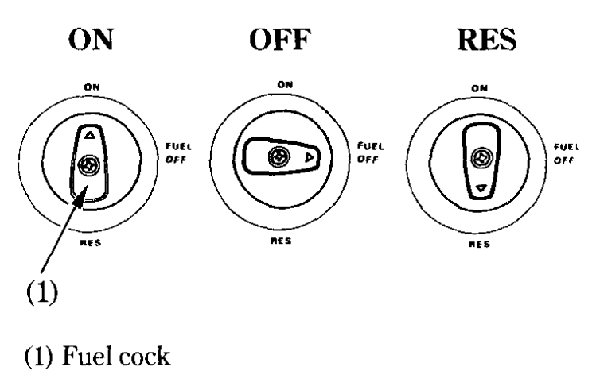
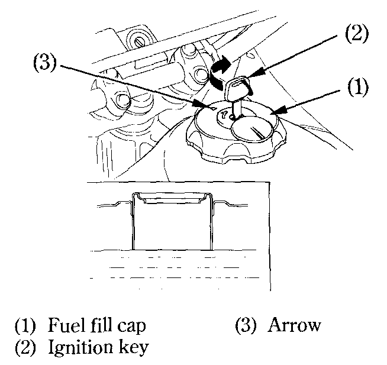
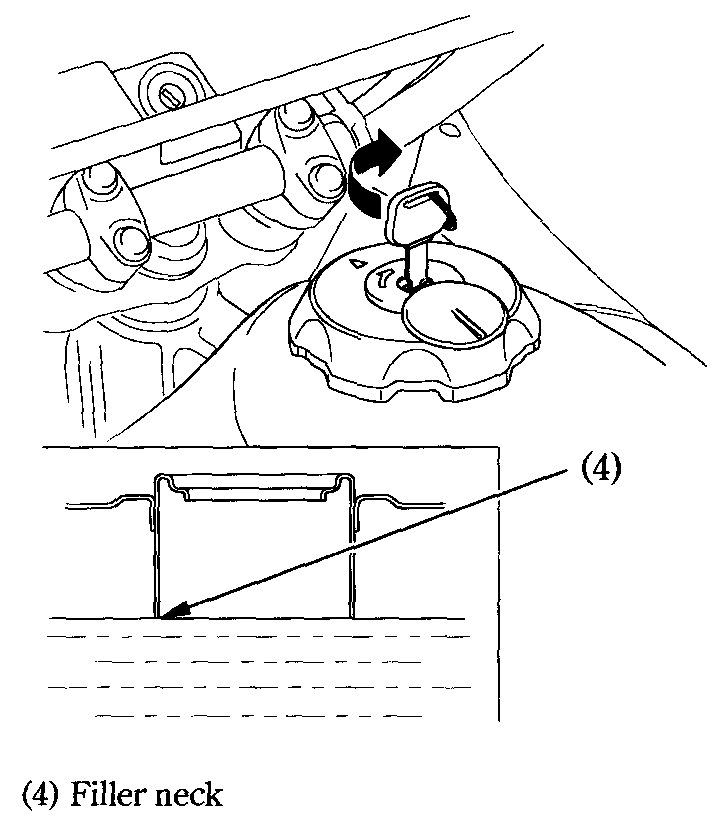

# Fuel

### Manual Fuel Cock

The manual fuel cock \(1\) is under the left side of the fuel tank. Set it to ON for normal operation or RES when you start to run out of the main fuel supply. The OFF setting is only for long term storage or servicing of fuel system components.

### Automatic Fuel ON-OFF

With the fuel cock set to ON \(or RES\) fuel flows to the carburetors only when the engine is being started or is running. A diaphragm shuts off fuel flow when the engine is turned off.

### Reserve Fuel

When the main fuel supply is gone, turn the fuel cock to RES. Refill the tank as soon as possible after switching to RES, then switch the cock back to ON.

The reserve fuel supply is:  
3.5&nbsp;L \(0.92&nbsp;US&nbsp;gal ,0.77&nbsp;Imp&nbsp;gal\)


**Warning**  
To avoid running out of fuel that may result in a sudden stop, learn how to operate the fuel cock when riding the motorcycle.



**Info**  
Remember to check that the fuel cock is in the ON position each time you refuel. If the cock is left in the RES position, you may run out of fuel with no reserve.


### Fuel Tank

The fuel tank capacity including the reserve supply is:  
18&nbsp;L \(4.8&nbsp;US&nbsp;gal, 4.0&nbsp;Imp&nbsp;gal\)

To open the fuel fill cap \(1\) insert the ignition key \(2\) and turn the key clockwise until it stops and rotate the fuel fill cap counterclockwise until it clicks. Lift off the fuel fill cap. After refueling, to close the fuel fill cap, align the tabs of the fuel fill cap to the slots of the filler neck with the arrow \(3\) mark on the cap pointing towards the rear of the motorcycle.

Turn the fuel fill cap clockwise until it clicks. The arrow should be pointing towards the front Turn the key counterclockwise until it stops and remove the key. Use unleaded or low-lead petrol with a research octane number of 91 or higher. We recommend that you use unleaded petrol because it produces fewer engine and spark plug deposits and extends the life of exhaust system components.


**Caution**  
If "spark knock" or "pinking" occurs at a steady engine speed under normal load, change brands of petrol. If spark knock or pinking persists, consult your authorized Honda dealer. Failure to do so is considered misuse, and damage caused by misuse is not covered by Honda's Limited Warranty.



**Warning**  
&bull;&nbsp;Petrol is extremely flammable and is explosive under certain conditions. Refuel in a well-ventilated area with the engine stopped. Do not smoke or allow flames or sparks in the area where petrol is stored or where the fuel tank is refueled.  
&bull;&nbsp;Do not overfill the tank \(there should be no fuel in the filler neck \(4\)\). After refueling, make sure the fuel fill cap is closed securely.  
&bull;&nbsp;Be careful not to spill fuel when refueling. Spilled fuel or fuel vapor may ignite. If any fuel is spilled, make sure the area is dry before starting the engine.  
&bull;&nbsp;Avoid repeated or prolonged contact with skin or breathing of vapor. KEEP OUT OF REACH OF CHILDREN.


### Petrol Containing Alcohol

If you decide to use a petrol containing alcohol \(gasohol\), be sure it's octane rating is at least as high as that recommended by Honda. There are two types of "gasohol": one containing ethanol, and the other containing methanol. Do not use petrol that contains more than 10% ethanol. Do not use petrol containing methanol \(methyl or wood alcohol\) that does not also contain cosolvents and corrosion inhibitors for methanol. Never use petrol containing more than 5% methanol, even if it has cosolvents and corrosion inhibitors.


**Info**  
&bull;&nbsp;Fuel system damage or engine performance problems resulting from the use of fuels that contain alcohol is not covered under the warranty. Honda cannot endorse the use of fuels containing methanol since evidence of their suitability is as yet incomplete.  
&bull;&nbsp;Before buying fuel from an unfamiliar station, try to find out if the fuel contains alcohol. If it does, confirm the type and percentage of alcohol used. If you notice any undesirable operating symptoms while using a petrol that contains alcohol, or one that you think contains alcohol, switch to a petrol that you know does not contain alcohol.


