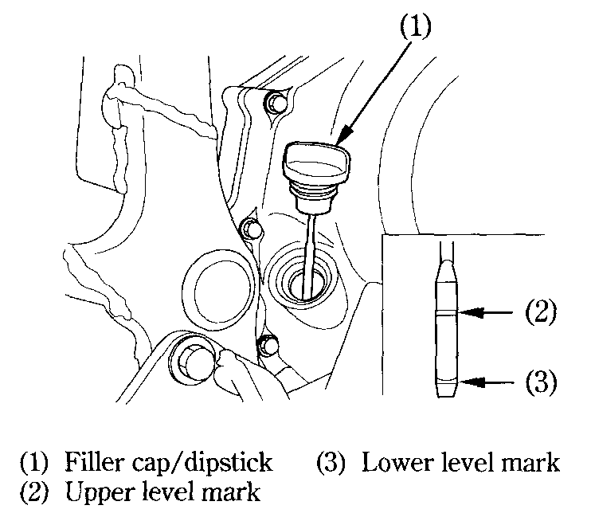

# Engine Oil

### Engine Oil Level Check​

Check the engine oil level each day before riding the motorcycle. The level must be maintained between the upper \(2\) and lower \(3\) level marks on the dipstick \(1\).

1. Start the engine and let it idle for a few minutes. Make sure the low oil pressure indicator goes off. If the light remains on, stop the engine immediately.​
2. Stop the engine and hold the motorcycle in an upright position on firm, level ground.​
3. After a few minutes, remove the oil filler cap/dipstick, wipe it clean, and reinsert the dipstick without screwing it in. Remove the dipstick. The oil level should be between the upper and lower marks on the dipstick.​
4. If required, add the specified oil \(see page 54\) up to the upper level mark. Do not overfill.​
5. Reinstall the oil filler cap/dipstick. Check for oil leaks.​


**Caution**  
Running the engine with insufficient oil can cause serious engine damage.


