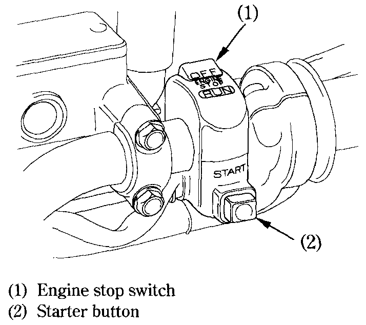

# Right Handlebar Control

### Engine Stop Switch

The engine stop switch \(1\) is next to the throttle grip. When the switch is in the RUN position, the engine will operate. When the switch is in the OFF position, the engine will not operate. This switch is intended primarily as a safety or emergency switch and should normally remain in the RUN position.

### Starter Button

The starter button \(2\) is below the engine stop switch \(1\).

When the starter button is pressed, the starter motor cranks the engine. If the engine stop switch is in the OFF position, the starter motor will not operate. See page 39 for the starting procedure.

