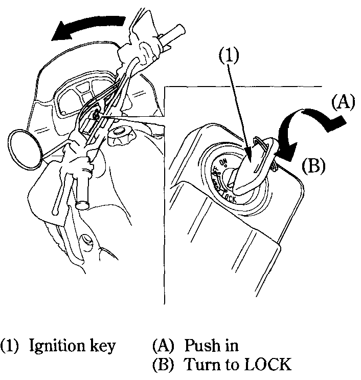

# Steering Lock

To lock the steering, turn the handlebars all the way to the left or right, turn the key \(1\) to LOCK while pushing in. Remove the key.​


**Warning**  
Do not turn the key to LOCK while riding the motorcycle; loss of vehicle control may result.


