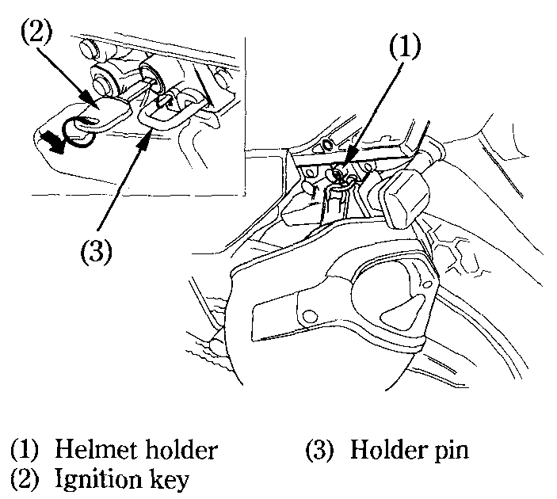

# Helmet Holder

The helmet holder \(1\) is on the left side of the rear carrier. Insert the ignition key \(2\) and turn it clockwise to unlock.​

Hang your helmet on the holder pin \(3\) and push it in to lock. Remove the Key.​


**Warning**  
The helmet holder is designed for helmet security while parked. Do not ride with a helmet attached to the holder; the helmet may interfere with safe operation and result in loss of control.


