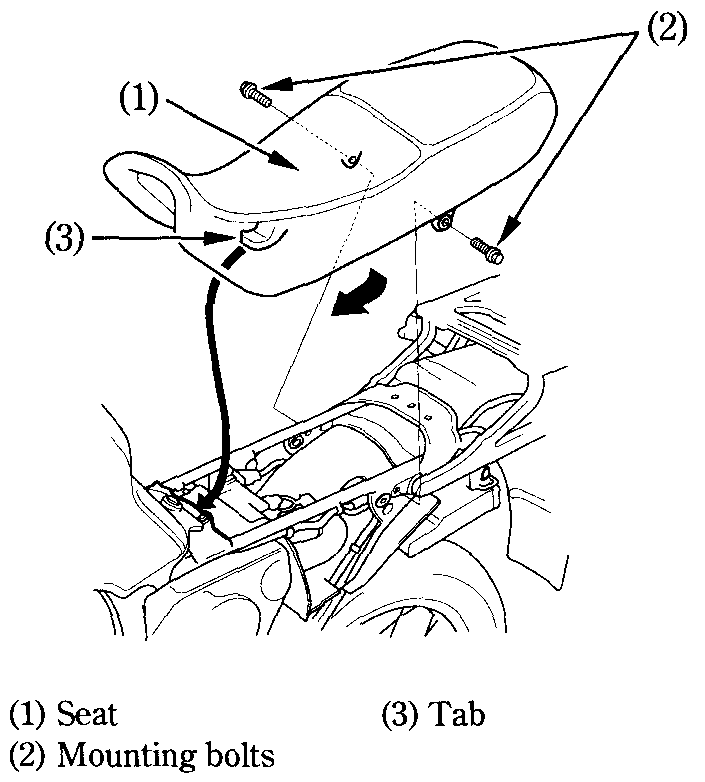

# Seat

To remove the seat \(1\), remove both side covers, remove the seat mounting bolts \(2\), and then pull the seat back and up.​

To install the seat, insert the tab \(3\) into the recess under the frame and tighten the mount bolts securely.​

