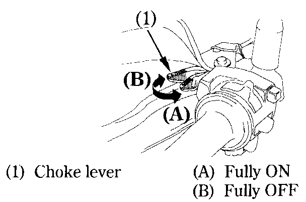

# Starting the Engine

This motorcycle is equipped with a side stand ignition cut-off system. The engine cannot be started if the side stand is down, _unless the transmission is in neutral_. If the side stand is up, the engine can be started in neutral or in gear with the clutch lever pulled in. After starting with the side stand down, the engine will shut off if the transmission is put in gear before raising the side stand.


**Warning**  
Never run the engine in an enclosed area. The exhaust contains poisonous carbon monoxide gas that can cause loss of consciousness and lead to death.



**Note**  
Do not use the electric starter for more than 5 seconds at a time. Release the starter button for approximately 10 seconds before pressing it again.


## Preparation

Before starting, insert the key, turn the ignition switch ON and confirm the following:

* _The transmission is in NEUTRAL_ \(neutral indicator light ON\).
* The engine stop switch is at RUN.
* The red low oil pressure indicator is ON.

## Starting Procedure

To restart a warm engine, follow the procedure for "High Air Temperature".

### Normal Air Temperature 10°-35°C \(50°-95°F\).

1. Pull the choke lever \(1\) back all the way to Fully ON \(A\), if the engine is cold.
2. Start the engine, leaving the throttle closed.
3. Immediately after the engine starts, operate the choke lever \(1\) to keep fast idle at: 2,000 - 3,000 min^-1 \(rpm\)
4. About a half minute after the engine starts, push the choke lever \(1\) forward all the way to Fully OFF \(B\).
5. If idling is unstable, open the throttle slightly.


**Note**  
Do not open the throttle when starting the engine with the choke ON. This will lean the mixture, resulting in hard starting. \(1\)



**Caution**  
The red low oil pressure indicator should go off a few seconds after the engine starts. If the light stays on, stop the engine immediately and check engine oil level. Operating the engine with insufficient oil pressure can cause serious engine damage.


### High Air Temperature 35°C \(95°F\) or above

* Do not use the choke.
* Open the throttle slightly.
* Start the engine.

### Low Air Temperature 10°C \(60°F\) or below

1. Follow steps 1-2 under "Normal Air Temperature".
2. When engine speed begins to pick up, operate the choke lever to keep fast idle at: 2,000 - 3,000 min^-1 \(rpm\)
3. Continue warming up the engine until it runs smoothly and responds to the throttle when the choke lever \(1\) is at Fully OFF \(B\).

## Flooded Engine

If the engine fails to start after repeated attempts, it may be flooded with excess fuel. To clear a flooded engine, leave the engine stop switch on RUN and push the choke lever forward to Fully OFF \(B\). Open the throttle fully and crank the engine for 5 seconds. If the engine starts, quickly close the throttle, then open it slightly if idling is unstable. If the engine does not start, wait 10 seconds, then follow the Starting Procedure.

