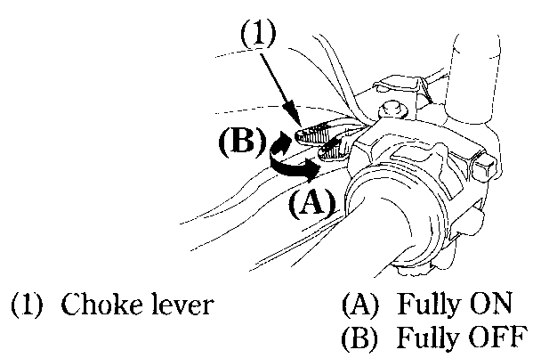

# Starting Procedure

To restart a warm engine, follow the procedure for "High Air Temperature."


**Warning**  
Normal Air Temperature 10°—35°C \(50°—95°F\).


1. Pull the choke lever \(1\) back all the way to Fully ON \(A\), if the engine is cold.
2. Start the engine, leaving the throttle closed.
3. Immediately after the engine starts, operate the choke lever \(1\) to keep fast idle at: 2,000 — 3,000 min^-1 \(rpm\)
4. About a half minute after the engine starts, push the choke lever \(1\) forward all the way to Fully OFF \(B\).
5. If idling is unstable, open the throttle slightly.


**Note**  
Do not open the throttle when starting the engine with the choke ON. This will lean the mixture, resulting in hard starting. \(1\)



**Caution**  
The red low oil pressure indicator should go off a few seconds after the engine starts. If the light stays on, stop the engine immediately and check engine oil level. Operating the engine with insufficient oil pressure can cause serious engine damage.


### High Air Temperature 35°C \(95°F\) or above

* Do not use the choke.
* Open the throttle slightly.
* Start the engine.

### Low Air Temperature 10°C \(60°F\) or below

1. Follow steps 1 —  2 under "Normal Air Temperature."
2. When engine speed begins to pick up, operate the choke lever to keep fast idle at: 2,000 — 3,000 min^-1 \(rpm\)
3. Continue warming up the engine until it runs smoothly and responds to the throttle when the choke lever \(1\) is at Fully OFF \(B\).

