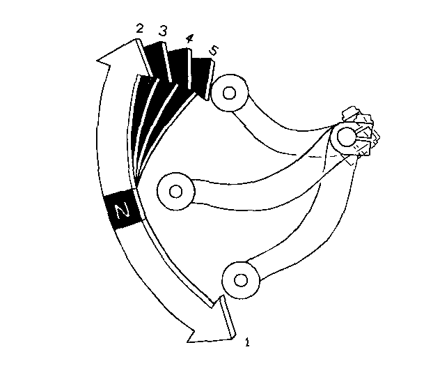

# Riding


**Warning**  
Review Motorcycle Safety \(pages 1-6\) before you ride.



**Note**  
Make sure you understand the function of the side stand mechanism. (See MAIN-TENANCE SCHEDULE [\[on page\]](https://xl400v.gitbook.io/honda-transalp/owners-manual/07/01) and explanation for SIDE STAND [\[on page\]](https://xl400v.gitbook.io/honda-transalp/owners-manual/07/15)).


1.	After the engine has been warmed up, the motorcycle is ready for riding.
2.	While the engine is idling, pull in the clutch lever and depress the gearshift pedal to shift into 1st \(low\) gear.
3.	Slowly release the clutch lever and at the same time gradually increase engine _speed by opening the throttle._ Coordination of the throttle and clutch lever will assure a smooth positive start.
4.	When the motorcycle attains a moderate speed, close the throttle, pull in the clutch lever and shift to 2nd gear by raising the gearshift pedal.
5.	This sequence is repeated to progressive¬ly shift to 3rd, 4th and 5th \(top\) gears.
6.	Raise the pedal to shift to a higher gear and depress the pedal to shift to a lower gear. Each stroke of the pedal engages the next gear in sequence. The pedal automatically returns to the horizontal position when released.

